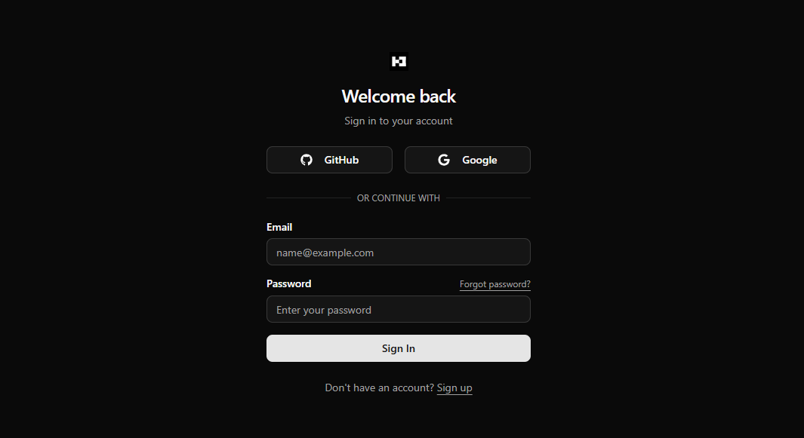

# Next.js Better Auth Template

A starter template for implementing authentication in Next.js using Better Auth. This template is designed as a practical foundation for developers building secure authentication systems, featuring built-in support for email verification, OAuth integration, and password management. Ideal for jumpstarting production-ready apps or learning modern auth workflows in Next.js.



## Features

- ✉️ Email verification
- 🔄 Password reset functionality
- 📧 Email-based authentication
- 🔑 OAuth authentication (Google, GitHub)

## Tech Stack

- **Framework:** Next.js 15
- **UI Components:** ShadCN
- **Styling:** Tailwind CSS
- **Database:** Neon (PostgreSQL)
- **ORM:** Drizzle
- **Authentication:** Better-auth
- **Email:** Nodemailer

## Getting Started

### Prerequisites

- Node.js (Latest LTS version recommended)
- npm or yarn
- PostgreSQL database (or Neon account)

### Setting up Google App Password for Nodemailer

1. Go to your Google Account settings (https://myaccount.google.com/)
2. Enable 2-Step Verification if not already enabled
3. Go to Security → App passwords (https://myaccount.google.com/apppasswords)
4. Enter a name for your app (e.g., "Next.js Auth")
5. Copy the password and use it as your `EMAIL_PASS` in the `.env` file

### Installation

1. Clone the repository:
```bash
git clone https://github.com/marrrkkk/nextjs-better-auth-template.git
cd nextjs-better-auth
```

2. Install dependencies:
```bash
npm install
```

3. Set up environment variables by renaming `.env.example` to `.env` or `.env.local` and fill in variables:
```env
BETTER_AUTH_SECRET=
BETTER_AUTH_URL=http://localhost:3000 #Base URL of your app

DATABASE_URL=

GOOGLE_CLIENT_ID=
GOOGLE_CLIENT_SECRET=

GITHUB_CLIENT_ID=
GITHUB_CLIENT_SECRET=

EMAIL_FROM=
EMAIL_USER=
EMAIL_PASS=
EMAIL_VERIFICATION_CALLBACK_URL=http://localhost:3000/email-verified
```

5. Run database migrations:
```bash
npx drizzle-kit generate
npx drizzle-kit migrate
```

5. Start the development server:
```bash
npm run dev
```

Open [http://localhost:3000](http://localhost:3000) with your browser


## Learn More

To learn more about the technologies used in this project:

- [Better Auth Documentation](https://www.better-auth.com/docs/introduction)
- [Next.js Documentation](https://nextjs.org/docs)
- [Drizzle ORM Documentation](https://orm.drizzle.team/docs/overview)
